---
## Author
author:
  name: Умед Джамшедович Назармамадов
  affiliation:
    - name: Российский университет дружбы народов
      country: Российская Федерация
      postal-code: 117198
      city: Москва
      address: ул. Миклухо-Маклая, д. 6

## Title
title: "Лабораторная работа №1"
subtitle: "Julia. Установка и настройка. Основные принципы"
license: "CC BY"
abstract: |
  В отчёте описана подготовка рабочего окружения для работы с языком программирования Julia: установка Julia, Jupyter Lab и ядра IJulia в среде WSL Ubuntu.

  Воспроизведены базовые примеры синтаксиса Julia (типы данных, преобразование типов, функции, векторы и матрицы) и выполнены четыре задания для самостоятельной работы: функции ввода-вывода, функция `parse()`, арифметика с разными типами данных, операции над матрицами и векторами.

  Все результаты подтверждены скриншотами выполнения кода в Jupyter Lab.
keywords: [Julia, Jupyter, IJulia, лабораторная работа, синтаксис]
---

# Введение

## Актуальность

Julia — язык программирования, ориентированный на научные и численные вычисления, сочетающий динамическую типизацию с производительностью, близкой к компилируемым языкам за счёт JIT-компиляции через LLVM. Он используется в курсе «Компьютерный практикум по статистическому анализу данных» как основной инструмент для последующих лабораторных работ, поэтому важно на первом занятии освоить установку окружения и базовый синтаксис.

## Цель работы

Подготовить рабочее пространство и инструментарий для работы с языком программирования Julia, на простейших примерах познакомиться с основами синтаксиса Julia.

## Задачи

1. Установить Julia и Jupyter под свою операционную систему.
2. Используя Jupyter Lab, повторить примеры из раздела 1.3.3 методических указаний.
3. Выполнить задания для самостоятельной работы (раздел 1.3.4): функции ввода-вывода, `parse()`, арифметика с разными типами, операции над матрицами и векторами.

## Объект и предмет исследования

Объект исследования — язык программирования Julia и среда интерактивной разработки Jupyter Lab. Предмет исследования — базовые конструкции синтаксиса Julia: система типов, преобразование и приведение типов, функции, работа с векторами и матрицами.

## Методы исследования

Практическая работа в интерактивной среде Jupyter Lab (ядро IJulia): последовательное выполнение примеров кода в ячейках блокнота с анализом полученных результатов.

## Схема выполнения работы

На рис. -@fig-flowchart представлена общая последовательность действий при выполнении работы.

::: {#fig-flowchart}

```{mermaid}
%%| fig-width: 100%
graph TD
    A@{ shape: circle, label: "Начало" } --> B[Выполнить действие]
    B --> C[Описать, что конкретно сделано]
    C --> D[Подтвердить скриншотом]
    D --> E[Занести в отчёт]
    E --> F[Поместить в git-репозиторий]
    F --> G[Сделать релиз git]
    G --> J@{ shape: dbl-circ, label: "Конец" }
```

Блок-схема выполнения лабораторной работы

:::

# Теоретическая часть

Julia использует динамическую типизацию с системой параметрических типов (например, `Int64`, `Float64`, `Complex{Float64}`), между которыми при смешанных операциях действует автоматическое повышение типа (*type promotion*) — более узкий тип приводится к более широкому. Для явного управления типами служат конструкторы типов (`Int64(x)`), функция `convert()` и функция `promote()`, приводящая набор аргументов к общему типу.

Интерактивная работа с Julia в этой лабораторной ведётся через Jupyter — пакет `IJulia` регистрирует ядро Julia в Jupyter, после чего блокноты `.ipynb` можно выполнять как в Jupyter Notebook, так и в Jupyter Lab.

# Материалы и методы

Работа выполнена в следующем окружении:

- ОС: WSL2 Ubuntu (Windows);
- Julia 1.10.5;
- Jupyter Lab 4.6.3, ядро IJulia 1.34.4;
- рабочее пространство организовано по шаблону курса (`course-directory-student-template`), лабораторная — в ветке `feature/lab01` git-репозитория `2026-2--study--computer-practice`.

Последовательность действий: проверка и установка недостающих компонентов (Julia уже был установлен ранее, дополнительно установлены `IJulia` и `jupyterlab`), запуск Jupyter Lab, создание блокнота `intro-julia.ipynb` с ядром Julia 1.10, последовательное выполнение примеров и заданий с фиксацией результата скриншотом.

# Выполнение лабораторной работы

## Подготовка инструментария к работе

Проверены версии уже установленных компонентов (рис. -@fig-001).

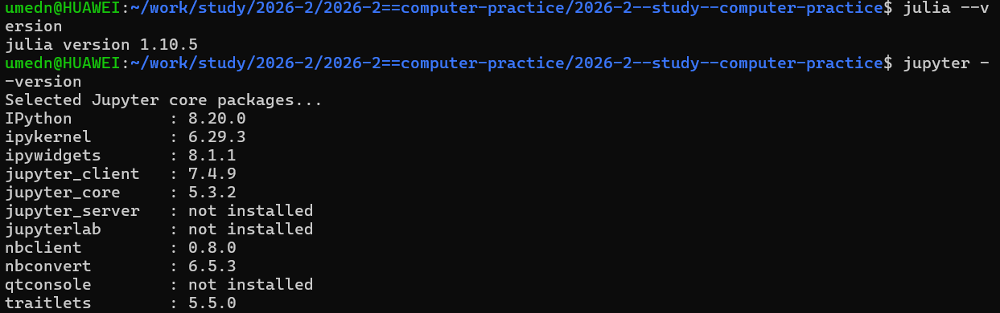{#fig-001 width=90%}

Установлен пакет `IJulia`, добавляющий ядро Julia в Jupyter (рис. -@fig-002).

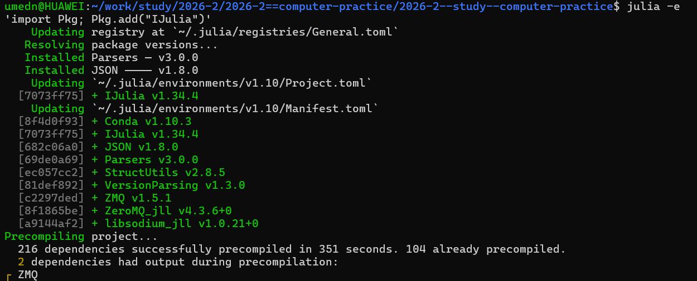{#fig-002 width=90%}

Jupyter Lab отсутствовал (был только классический `notebook`), поэтому установлен отдельно через `pip` с флагом `--break-system-packages` (рис. -@fig-003).

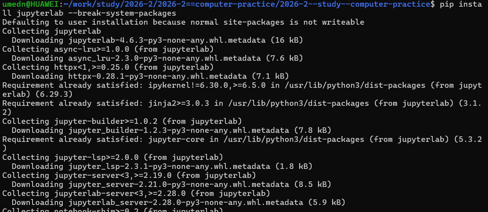{#fig-003 width=90%}

Создан каталог для проекта лабораторной внутри репозитория курса (рис. -@fig-004).

{#fig-004 width=90%}

После добавления `~/.local/bin` в `PATH` Jupyter Lab успешно запущен (рис. -@fig-005).

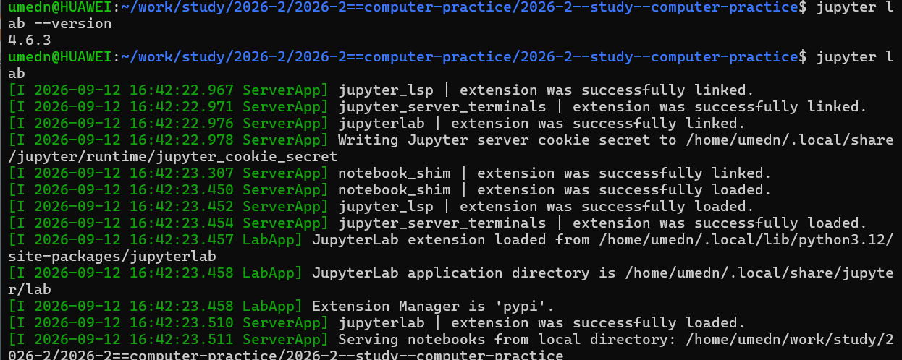{#fig-005 width=90%}

## Основы синтаксиса Julia (примеры раздела 1.3.3)

В блокноте `intro-julia.ipynb` с ядром Julia 1.10 последовательно выполнены примеры из методических указаний.

Определение типа числовой величины для целого, вещественного, комплексного числа и результата операции даёт ожидаемые типы `Int64`, `Float64`, `Complex{Float64}`, `Irrational` (рис. -@fig-006).

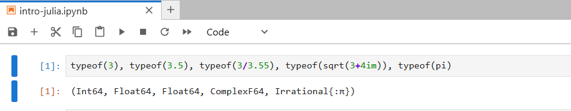{#fig-006 width=90%}

Деление на ноль для вещественных чисел даёт специальные значения `Inf`, `-Inf`, `NaN` (рис. -@fig-007), которые имеют тип `Float64` (рис. -@fig-008).

{#fig-007 width=90%}

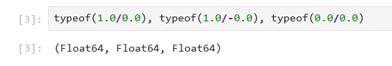{#fig-008 width=90%}

Цикл по всем целочисленным типам выводит границы их диапазонов (рис. -@fig-009).

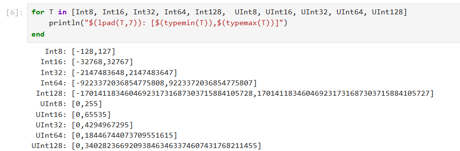{#fig-009 width=90%}

Прямое преобразование типов конструкторами `Int64()` и `Char()` (рис. -@fig-010) и эквивалентное преобразование через `convert()` (рис. -@fig-011) дают одинаковый результат.

{#fig-010 width=90%}

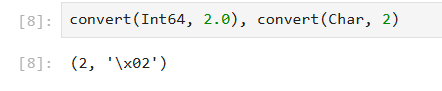{#fig-011 width=90%}

Преобразование числовых значений `1` и `0` в булев тип (рис. -@fig-012).

{#fig-012 width=90%}

Функция `promote()` приводит аргументы разных числовых типов (`Int8`, `Float16`, `Float32`) к общему типу `Float32` (рис. -@fig-013), что подтверждается функцией `typeof()` (рис. -@fig-014).

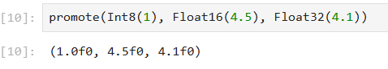{#fig-013 width=90%}

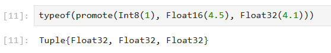{#fig-014 width=90%}

Определение функции полной формой (`function ... end`) на примере возведения в квадрат (рис. -@fig-015) и краткой однострочной формой (рис. -@fig-016) дают одинаковый результат.

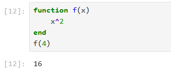{#fig-015 width=90%}

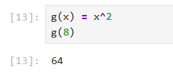{#fig-016 width=90%}

Определение одномерных массивов — вектора-строки и вектора-столбца — и обращение к их элементам по индексу (рис. -@fig-017).

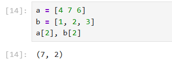{#fig-017 width=90%}

Определение двумерного массива (матрицы) и обращение к её элементам по паре индексов (рис. -@fig-018).

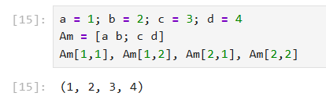{#fig-018 width=90%}

Умножение вектора-строки на матрицу и на транспонированный вектор-столбец (рис. -@fig-019).

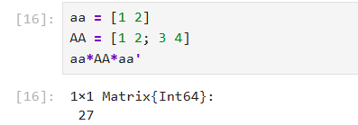{#fig-019 width=90%}

## Задания для самостоятельной работы (раздел 1.3.4)

### Задание 1. Функции чтения/записи/вывода информации

Сравнение `print()`, `println()` и `show()` показывает разницу в оформлении вывода: `print`/`println` выводят строку как есть, а `show` — в «программном» виде (строка в кавычках), что видно на примере с текстом «текст с кавычками» (рис. -@fig-020).

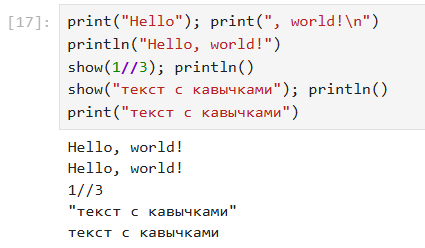{#fig-020 width=90%}

Функция `write()` записывает строку как байты в поток — в примере в буфер `IOBuffer`, при этом возвращает число записанных байт (рис. -@fig-021).

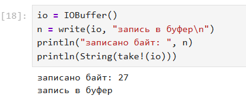{#fig-021 width=90%}

Файл записан построчно через `write()`, после чего продемонстрирована разница между `read()` (весь файл одной строкой), `readline()` (только первая строка потока) и `readlines()` (вектор всех строк) (рис. -@fig-022).

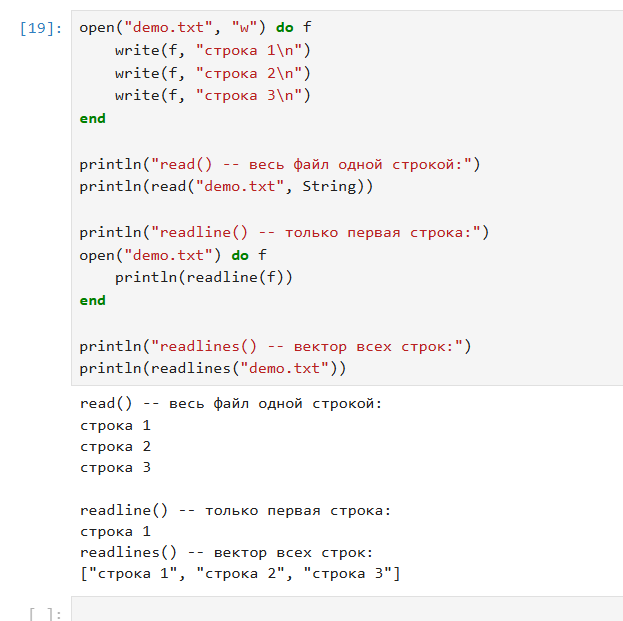{#fig-022 width=90%}

Функция `readdlm()` из стандартного пакета `DelimitedFiles` разбирает файл с разделителем-запятой в числовую матрицу (рис. -@fig-023).

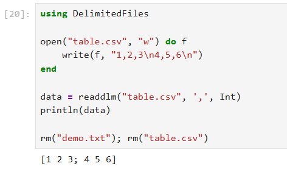{#fig-023 width=90%}

### Задание 2. Функция parse()

Базовое использование `parse()` для получения `Int`, `Float64` и `Bool` из строк (рис. -@fig-024).

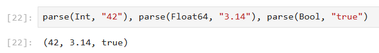{#fig-024 width=90%}

Именованный аргумент `base` позволяет разбирать строку в заданной системе счисления — двоичной и шестнадцатеричной (рис. -@fig-025).

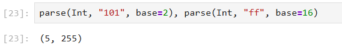{#fig-025 width=90%}

`tryparse()` — безопасный аналог `parse()`: при невозможности разбора возвращает `nothing` вместо исключения (рис. -@fig-026).

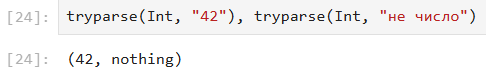{#fig-026 width=90%}

### Задание 3. Базовые математические операции с разными типами

При смешении `Int` и `Float64` результат автоматически приводится к `Float64`, а `Rational` (`5//2`) сохраняет свой тип, пока в выражении не появится вещественное число (рис. -@fig-027).

{#fig-027 width=90%}

Оператор `/` всегда возвращает `Float64`, `÷` выполняет целочисленное деление, `%` — вычисляет остаток (рис. -@fig-028).

{#fig-028 width=90%}

Возведение в степень (`^`) и извлечение корней (`sqrt`, `cbrt`) на примере степени 0.5 как альтернативы `sqrt()` (рис. -@fig-029).

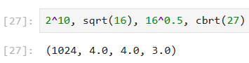{#fig-029 width=90%}

Оператор `==` сравнивает значения независимо от типа, `===` — дополнительно сравнивает тип, а сравнения можно объединять в цепочку (рис. -@fig-030).

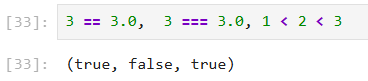{#fig-030 width=90%}

Логические операции `&&`, `||`, `!`, `xor()` (рис. -@fig-031).

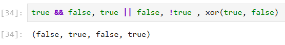{#fig-031 width=90%}

Арифметика с комплексными числами: сложение, умножение и вычисление модуля (рис. -@fig-032).

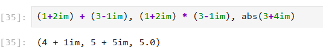{#fig-032 width=90%}

### Задание 4. Операции над матрицами и векторами

Поэлементное сложение, вычитание векторов и умножение вектора на скаляр (рис. -@fig-033).

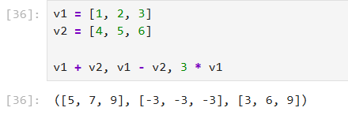{#fig-033 width=90%}

Скалярное произведение векторов вычислено двумя способами: функцией `dot()` из пакета `LinearAlgebra` и через умножение транспонированного вектора на вектор (рис. -@fig-034).

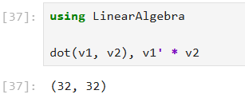{#fig-034 width=90%}

Сложение и вычитание матриц выполняются поэлементно (рис. -@fig-035).

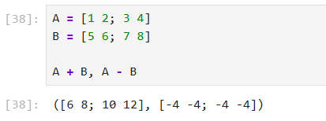{#fig-035 width=90%}

Транспонирование матрицы через оператор `'` и функцию `transpose()` даёт одинаковый результат для вещественной матрицы (рис. -@fig-036).

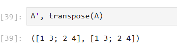{#fig-036 width=90%}

Умножение матрицы на скаляр, матричное умножение `A*B` и поэлементное умножение `A .* B` дают разные результаты (рис. -@fig-037).

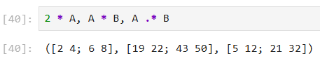{#fig-037 width=90%}

# Результаты

- Julia 1.10.5, Jupyter Lab 4.6.3 и ядро IJulia установлены и настроены, блокнот `intro-julia.ipynb` создан и выполнен с ядром Julia.
- Все примеры раздела 1.3.3 воспроизведены, результаты совпадают с методическими указаниями.
- Задание 1 выполнено: показана разница между `print`/`println`/`show`, продемонстрированы `write()`, `read()`, `readline()`, `readlines()`, `readdlm()`.
- Задание 2 выполнено: показана работа `parse()` с базовыми типами, с указанием системы счисления и безопасный разбор через `tryparse()`.
- Задание 3 выполнено: рассмотрены арифметические операции со смешанными типами, деление и остаток, степени и корни, сравнение значений и типов, логические операции, арифметика комплексных чисел.
- Задание 4 выполнено: рассмотрены сложение/вычитание векторов и матриц, умножение на скаляр, скалярное произведение, транспонирование, матричное и поэлементное умножение.

# Обсуждение результатов

Результаты выполнения примеров и заданий полностью совпали с ожидаемым поведением, описанным в теоретической части: система типов Julia действительно повышает тип при смешанных операциях, а специализированные операторы (`÷`, `//`, `.*`) сохраняют математический смысл, отличный от их «обычных» аналогов (`/`, `*`).

В процессе установки возникла техническая сложность: после установки Jupyter Lab через `pip install jupyterlab --break-system-packages` команда `jupyter lab` не находилась, так как каталог `~/.local/bin` отсутствовал в переменной `PATH`. Проблема решена добавлением каталога в `PATH` через `~/.bashrc`.

Также при наборе выражения `3 == 3.0, 3 === 3.0, 1 < 2 < 3` возникла ошибка `not a unary operator`, вызванная переносом строки прямо перед оператором `===` — Julia интерпретировала часть после переноса как новое выражение, начинающееся со знака `=`. После записи выражения одной строкой без переносов код выполнился корректно.

# Заключение

- Поставленная цель работы достигнута: рабочее окружение для Julia подготовлено, основы синтаксиса освоены на практике.
- Получены навыки установки и настройки Julia, Jupyter Lab и IJulia в среде WSL Ubuntu.
- Изучены и опробованы на собственных примерах функции ввода-вывода, `parse()`/`tryparse()`, арифметические и логические операторы, операции над матрицами и векторами.
- Рекомендация: при дальнейшей работе с Julia в Jupyter обращать внимание на перенос строк в многострочных выражениях REPL/ячеек, чтобы избежать ошибок разбора.

# Список литературы {.unnumbered}

1. Julia 1.5 Documentation. — 2020. — URL: <https://docs.julialang.org/en/v1/>.
2. Klok H., Nazarathy Y. Statistics with Julia: Fundamentals for Data Science, Machine Learning and Artificial Intelligence. — 2020. — URL: <https://statisticswithjulia.org/>.
3. Ökten G. First Semester in Numerical Analysis with Julia. — Florida State University, 2019.
4. Антонюк В. А. Язык Julia как инструмент исследователя. — М. : Физический факультет МГУ им. М. В. Ломоносова, 2019.
5. Шиндин А. В. Язык программирования математических вычислений Julia. Базовое руководство. — Нижний Новгород : Нижегородский госуниверситет, 2016.

\appendix

# Листинг кода блокнота intro-julia.ipynb {.appendix}

```julia
# --- 1.3.3. Основы синтаксиса Julia ---

typeof(3), typeof(3.5), typeof(3/3.55), typeof(sqrt(3+4im)), typeof(pi)

1.0/0.0, 1.0/(-0.0), 0.0/0.0

typeof(1.0/0.0), typeof(1.0/-0.0), typeof(0.0/0.0)

for T in [Int8, Int16, Int32, Int64, Int128, UInt8, UInt16, UInt32, UInt64, UInt128]
    println("$(lpad(T,7)): [$(typemin(T)),$(typemax(T))]")
end

Int64(2.0), Char(2)

convert(Int64, 2.0), convert(Char, 2)

Bool(1), Bool(0)

promote(Int8(1), Float16(4.5), Float32(4.1))

typeof(promote(Int8(1), Float16(4.5), Float32(4.1)))

function f(x)
    x^2
end
f(4)

g(x) = x^2
g(8)

a = [4 7 6]
b = [1, 2, 3]
a[2], b[2]

a = 1; b = 2; c = 3; d = 4
Am = [a b; c d]
Am[1,1], Am[1,2], Am[2,1], Am[2,2]

aa = [1 2]
AA = [1 2; 3 4]
aa*AA*aa'

# --- 1.3.4. Задание 1: чтение/запись/вывод ---

print("Hello"); print(", world!\n")
println("Hello, world!")
show(1//3); println()
show("текст с кавычками"); println()
print("текст с кавычками")

io = IOBuffer()
n = write(io, "запись в буфер\n")
println("записано байт: ", n)
println(String(take!(io)))

open("demo.txt", "w") do f
    write(f, "строка 1\n")
    write(f, "строка 2\n")
    write(f, "строка 3\n")
end

println("read() -- весь файл одной строкой:")
println(read("demo.txt", String))

println("readline() -- только первая строка:")
open("demo.txt") do f
    println(readline(f))
end

println("readlines() -- вектор всех строк:")
println(readlines("demo.txt"))

using DelimitedFiles

open("table.csv", "w") do f
    write(f, "1,2,3\n4,5,6\n")
end

data = readdlm("table.csv", ',', Int)
println(data)

rm("demo.txt"); rm("table.csv")

# --- Задание 2: parse() ---

parse(Int, "42"), parse(Float64, "3.14"), parse(Bool, "true")

parse(Int, "101", base=2), parse(Int, "ff", base=16)

tryparse(Int, "42"), tryparse(Int, "не число")

# --- Задание 3: арифметика с разными типами ---

5 + 3, 5 + 3.0, 5 // 2, 5 // 2 + 0.5

7 / 2, 7 ÷ 2, 7 % 2

2^10, sqrt(16), 16^0.5, cbrt(27)

3 == 3.0, 3 === 3.0, 1 < 2 < 3

true && false, true || false, !true, xor(true, false)

(1+2im) + (3-1im), (1+2im) * (3-1im), abs(3+4im)

# --- Задание 4: матрицы и векторы ---

v1 = [1, 2, 3]
v2 = [4, 5, 6]

v1 + v2, v1 - v2, 3 * v1

using LinearAlgebra

dot(v1, v2), v1' * v2

A = [1 2; 3 4]
B = [5 6; 7 8]

A + B, A - B

A', transpose(A)

2 * A, A * B, A .* B
```
