---
## Author
author:
  name: Умед Джамшедович Назармамадов
  affiliation:
    - name: Российский университет дружбы народов
      country: Российская Федерация
      postal-code: 117198
      city: Москва
      address: ул. Миклухо-Маклая, д. 6

## Title
title: "Лабораторная работа №2"
subtitle: "Структуры данных"
license: "CC BY"
abstract: |
  В отчёте рассмотрены основные структуры данных языка Julia: кортежи, словари, множества и массивы, а также общие функции для работы с ними (`isempty`, `length`, `in`, `unique`, `reduce`, `maximum`/`minimum`).

  Воспроизведены примеры из методических указаний и выполнены задания для самостоятельной работы: операции над множествами, различные способы построения массивов и векторов, работа с пакетом `Primes`, вычисление сумм рядов.

  Все результаты подтверждены скриншотами выполнения кода в Jupyter Lab.
keywords: [Julia, кортежи, словари, множества, массивы, лабораторная работа]
---

# Введение

## Актуальность

Структуры данных — кортежи, словари, множества и массивы — базовый инструментарий для представления и обработки данных в любой задаче статистического анализа. Понимание их особенностей в Julia (неизменяемость кортежей, неупорядоченность словарей и множеств, широкие возможности индексации и broadcasting для массивов) необходимо для дальнейшей работы с данными в курсе.

## Цель работы

Изучить несколько структур данных, реализованных в Julia, научиться применять их и операции над ними для решения задач.

## Задачи

1. Используя Jupyter Lab, повторить примеры из раздела 2.2 методических указаний (кортежи, словари, множества, массивы).
2. Выполнить задания для самостоятельной работы (раздел 2.4): операции над множествами, построение массивов различными способами, работа с пакетом `Primes`, вычисление сумм рядов.

## Объект и предмет исследования

Объект исследования — структуры данных языка Julia (кортежи, словари, множества, массивы). Предмет исследования — операции над этими структурами и функции, общие для всех структур данных (`isempty()`, `length()`, `in()`, `unique()`, `reduce()`, `maximum()`/`minimum()`).

## Методы исследования

Практическая работа в интерактивной среде Jupyter Lab: последовательное выполнение примеров кода в ячейках блокнота с анализом полученных результатов.

## Схема выполнения работы

На рис. -@fig-flowchart представлена общая последовательность действий при выполнении работы.

::: {#fig-flowchart}

```{mermaid}
%%| fig-width: 100%
graph TD
    A@{ shape: circle, label: "Начало" } --> B[Выполнить действие]
    B --> C[Описать, что конкретно сделано]
    C --> D[Подтвердить скриншотом]
    D --> E[Занести в отчёт]
    E --> F[Поместить в git-репозиторий]
    F --> G[Сделать релиз git]
    G --> J@{ shape: dbl-circ, label: "Конец" }
```

Блок-схема выполнения лабораторной работы

:::

# Теоретическая часть

**Кортеж** (`Tuple`) — неизменяемая индексируемая последовательность элементов, индексация с единицы; поддерживает именованные поля (`NamedTuple`).

**Словарь** (`Dict`) — неупорядоченный набор пар «ключ — значение» с доступом по ключу.

**Множество** (`Set`) — неупорядоченная совокупность уникальных элементов, поддерживающая теоретико-множественные операции (`union`, `intersect`, `setdiff`, `issubset`).

**Массив** — упорядоченная коллекция элементов на многомерной сетке; векторы и матрицы — частные случаи массива. Поддерживает генераторы (list comprehension), broadcasting (`.`-операции) и гибкую индексацию срезами.

Общие для всех структур функции: `isempty()`, `length()`, `in()`, `unique()`, `reduce()`, `maximum()`/`minimum()`.

# Материалы и методы

Окружение то же, что и в лабораторной работе №1: WSL2 Ubuntu, Julia 1.10.5, Jupyter Lab 4.6.3 с ядром IJulia. Работа выполнена в ветке `feature/lab02` git-репозитория `2026-2--study--computer-practice`, блокнот `data-structures.ipynb` создан в `labs/lab02/project/`.

# Выполнение лабораторной работы

## Подготовка

Создана ветка `feature/lab02` (рис. -@fig-001) и рабочий каталог для блокнота, запущен Jupyter Lab (рис. -@fig-002).

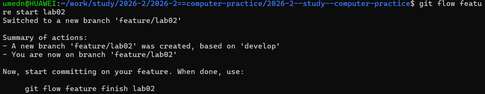{#fig-001 width=90%}

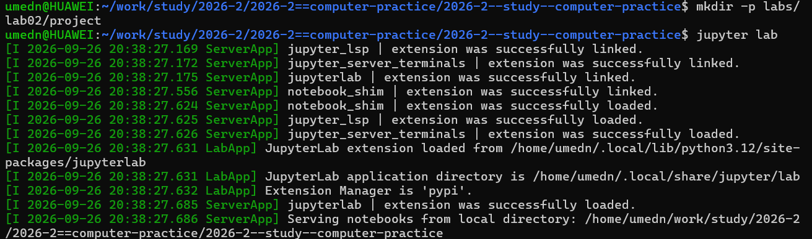{#fig-002 width=90%}

## Раздел 2.2. Структуры данных

### Кортежи

Определены пустой кортеж, кортеж строк, кортеж чисел, кортеж со смешанными типами и именованный кортеж (рис. -@fig-003).

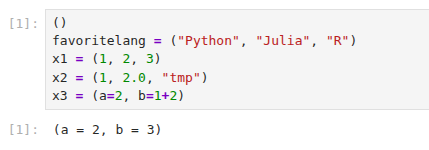{#fig-003 width=90%}

Продемонстрированы операции над кортежами: длина, индексация, обращение к полям именованного кортежа, проверка вхождения элемента через `in()` (рис. -@fig-004).

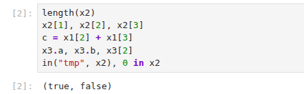{#fig-004 width=90%}

### Словари

Создан словарь `phonebook`, показаны `keys()`, `values()`, `pairs()`, `haskey()`, добавление и удаление элемента (`pop!`), объединение двух словарей функцией `merge()` — при совпадении ключей побеждает значение из второго аргумента (рис. -@fig-005).

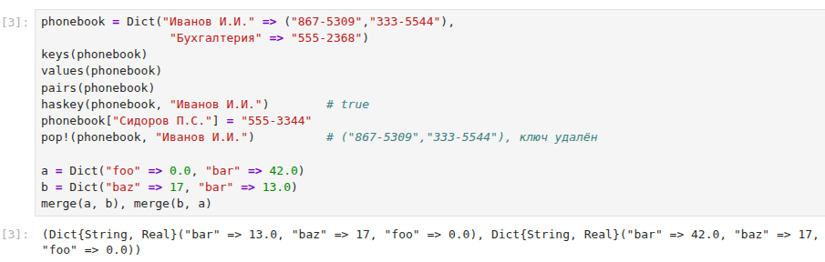{#fig-005 width=90%}

### Множества

Продемонстрированы создание множеств, проверка эквивалентности (`issetequal`), объединение, пересечение, разность множеств, проверка вложенности (`issubset`), добавление и удаление элемента (рис. -@fig-006).

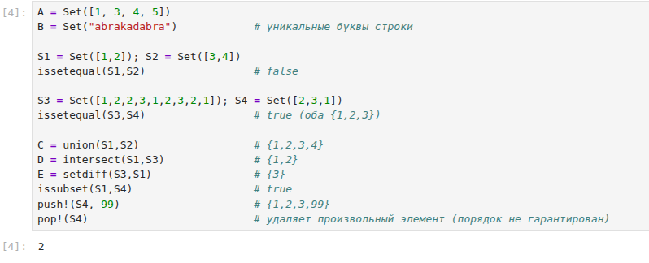{#fig-006 width=90%}

### Массивы

Показаны создание пустых и типизированных массивов, векторов-строк и векторов-столбцов, многомерных массивов, массивов через генераторы (list comprehension), функции `ones()`, `zeros()`, `fill()`, `repeat()`, `reshape()`, транспонирование, а также срезы и логическая индексация (`ar .> 14`, `findall()`) (рис. -@fig-007).

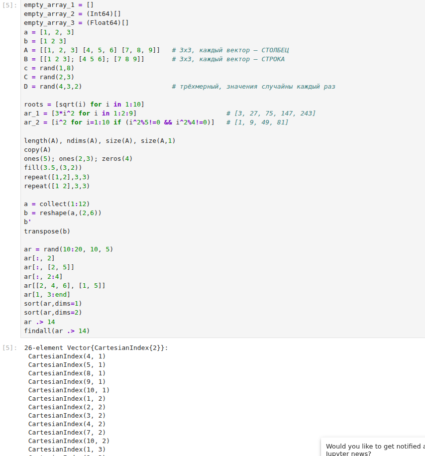{#fig-007 width=90%}

## Задания для самостоятельной работы (раздел 2.4)

### Задание 1

В формулировке задания выражение $P = A \cap B \cup A \cap B \cup A \cap C \cup B \cap C$ содержит повторяющееся слагаемое $A \cap B$; исходя из структуры формулы (типичная форма разложения через дополнение) второе слагаемое интерпретировано как $A \cap \overline{B}$, где $\overline{B}$ — дополнение $B$ до объединения всех трёх множеств. Результат $P = \{0, 1, 3, 4, 7, 9\}$ (рис. -@fig-008, верхняя часть).

### Задание 2

Приведены собственные примеры операций над множествами со смешанными типами элементов (числа, строки, символы) — `union`, `intersect`, `setdiff` для множеств типа `Set{Any}` (рис. -@fig-008, нижняя часть).

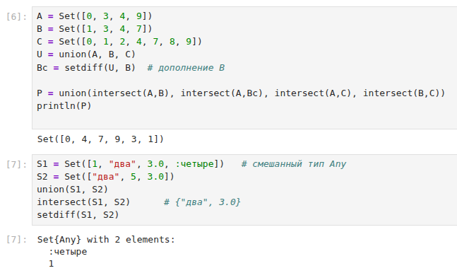{#fig-008 width=90%}

### Задание 3

Выполнены все 14 пунктов задания: построение возрастающего, убывающего и «пирамидального» массивов (3.1–3.3), массивы на основе повторения элементов вектора `tmp` разными способами (3.4–3.8), массив степеней двойки с подсчётом вхождений цифры (3.9), вектор значений функции $y=e^x\cos(x)$ и его среднее (3.10), вектор пар индексов (3.11), вектор с элементами $2^i/i$ (3.12), вектор строковых меток (3.13) и обширный набор операций над случайными векторами $x$, $y$ длины 250: разности, линейные комбинации, поэлементные тригонометрические выражения, сумма ряда, фильтрация по условию, статистика по чётности/кратности, сортировка одного вектора по перестановке другого, топ-10 значений и уникальные элементы (3.14) (рис. -@fig-009, -@fig-010).

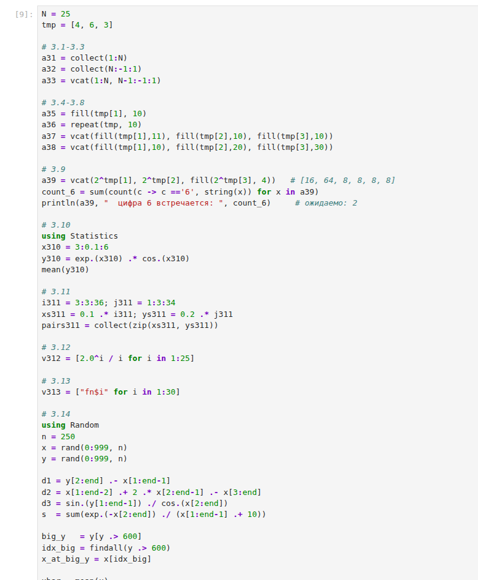{#fig-009 width=90%}

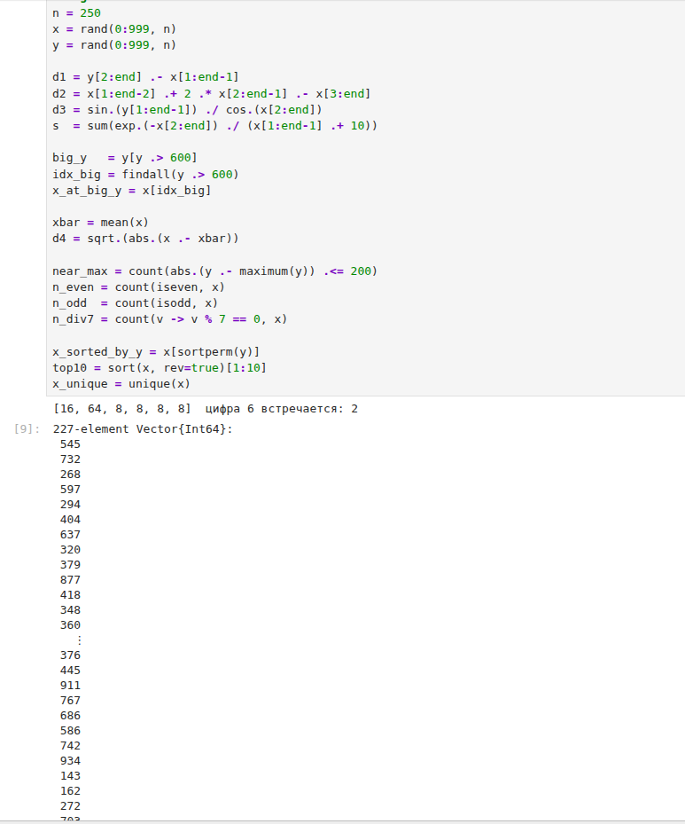{#fig-010 width=90%}

При выполнении пункта 3.9 возникла синтаксическая ошибка в выражении `count(=='6', ...)` — оператор `==` нельзя использовать в такой позиции как унарный. Ошибка исправлена заменой на анонимную функцию `count(c -> c == '6', string(x))`.

### Задание 4

Построен массив `squares` квадратов чисел от 1 до 100, последний элемент равен 10000 (рис. -@fig-011).

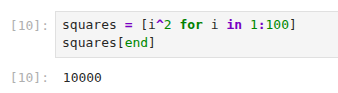{#fig-011 width=90%}

### Задание 5

Подключён пакет `Primes`, сгенерирован массив первых 168 простых чисел, 89-е наименьшее простое число равно 461, срез с 89-го по 99-й элемент — `[461, 463, 467, 479, 487, 491, 499, 503, 509, 521, 523]` (рис. -@fig-012).

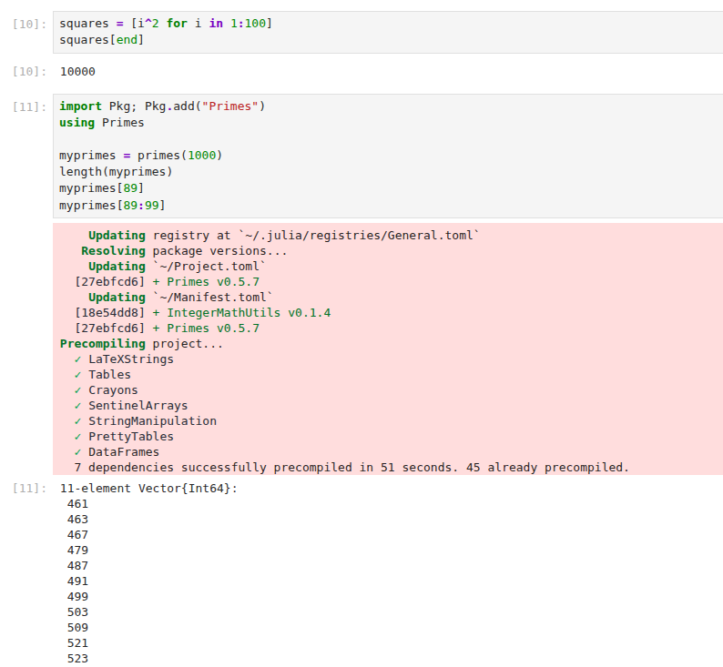{#fig-012 width=90%}

### Задание 6

Вычислены суммы: $\sum_{i=10}^{100}(i^3+4i^2) = 26852735$; $\sum_{i=1}^{25}\left(\frac{2^i}{i}+\frac{3^i}{i^2}\right) \approx 2.129\times10^{9}$; сумма ряда с накопленными частичными суммами $\approx 170.167$ (рис. -@fig-013).

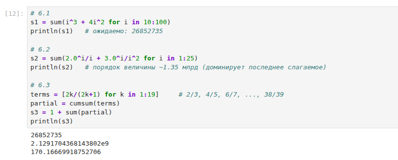{#fig-013 width=90%}

# Результаты

- Все примеры раздела 2.2 (кортежи, словари, множества, массивы) воспроизведены, результаты совпадают с методическими указаниями.
- Задание 1 выполнено с учётом уточнения неоднозначной формулы (дополнение множества $B$).
- Задание 2 выполнено на собственных примерах множеств смешанных типов.
- Задание 3 выполнено полностью (все 14 пунктов), включая операции над случайными векторами длины 250.
- Задание 4 и 5 выполнены, значения простых чисел подтверждены (89-е простое число — 461).
- Задание 6 выполнено, все три суммы вычислены.

# Обсуждение результатов

Работа с множествами и массивами в Julia подтвердила теоретические ожидания: операции над множествами (`union`, `intersect`,