---
## Author
author:
  name: Умед Джамшедович Назармамадов
  affiliation:
    - name: Российский университет дружбы народов
      country: Российская Федерация
      postal-code: 117198
      city: Москва
      address: ул. Миклухо-Маклая, д. 6

## Title
title: "Лабораторная работа №3"
subtitle: "Управляющие структуры"
license: "CC BY"
abstract: |
  В отчёте рассмотрены управляющие структуры языка Julia: циклы `while` и `for`, условные выражения (включая тернарный оператор), способы определения функций (полная, краткая, анонимная формы), функции высшего порядка `map()` и `broadcast()`, а также подключение сторонних пакетов на примере `Colors`.

  Воспроизведены примеры из раздела 3.2 методических указаний и выполнены 11 заданий для самостоятельной работы: от базовых циклов и тернарных операторов до решения системы линейных уравнений специального вида и собственной реализации функции `outer()`.

  Все результаты подтверждены скриншотами выполнения кода в Jupyter Lab.
keywords: [Julia, циклы, условные выражения, функции, map, broadcast, лабораторная работа]
---

# Введение

## Актуальность

Управляющие структуры — циклы, условные выражения и функции — основа любой программы обработки данных. В Julia они дополнены удобными инструментами: тернарным оператором, несколькими формами определения функций и функциями высшего порядка (`map`, `broadcast`), которые в сочетании с точечным синтаксисом заметно сокращают код при работе с матрицами.

## Цель работы

Освоить применение циклов, функций и сторонних для Julia пакетов для решения задач линейной алгебры и работы с матрицами.

## Задачи

1. Используя Jupyter Lab, повторить примеры из раздела 3.2 методических указаний (циклы, условные выражения, функции, сторонние пакеты).
2. Выполнить 11 заданий для самостоятельной работы (раздел 3.4), включая построение матриц со специальной структурой, собственную реализацию функции `outer()` и решение системы линейных уравнений.

## Объект и предмет исследования

Объект исследования — управляющие структуры языка Julia. Предмет исследования — циклы `while`/`for`, условные конструкции, различные формы функций, функции высшего порядка и их применение к задачам линейной алгебры.

## Методы исследования

Практическая работа в интерактивной среде Jupyter Lab: последовательное выполнение примеров и заданий в ячейках блокнота с анализом полученных результатов.

## Схема выполнения работы

На рис. -@fig-flowchart представлена общая последовательность действий при выполнении работы.

::: {#fig-flowchart}

```{mermaid}
%%| fig-width: 100%
graph TD
    A@{ shape: circle, label: "Начало" } --> B[Выполнить действие]
    B --> C[Описать, что конкретно сделано]
    C --> D[Подтвердить скриншотом]
    D --> E[Занести в отчёт]
    E --> F[Поместить в git-репозиторий]
    F --> G[Сделать релиз git]
    G --> J@{ shape: dbl-circ, label: "Конец" }
```

Блок-схема выполнения лабораторной работы

:::

# Теоретическая часть

Циклы `while` и `for` в Julia синтаксически похожи на аналоги в других языках, но `for` поддерживает компактную запись вложенных циклов (`for i in 1:m, j in 1:n`) и генераторы массивов (list comprehension).

Условные выражения записываются через `if`/`elseif`/`else`/`end` либо через тернарный оператор `a ? b : c`, эквивалентный полной форме `if a; b; else c; end`.

Функции можно определять тремя способами: полной формой (`function...end`), краткой однострочной (`f(x) = ...`) и как анонимные функции (`x -> ...`). По соглашению имена функций с восклицательным знаком (`sort!`) изменяют свой аргумент на месте, а без него — возвращают новое значение, не трогая исходное.

`map()` и `broadcast()` — функции высшего порядка, применяющие переданную функцию к каждому элементу структуры данных; точечный синтаксис `f.(x)` — короткая запись для `broadcast(f, x)`. В отличие от `map`, `broadcast` дополнительно умеет согласовывать размерности аргументов.

Сторонние пакеты подключаются в два этапа: установка (`Pkg.add("Имя")`) один раз на систему и загрузка (`using Имя`) в каждом новом сеансе.

# Материалы и методы

Окружение то же, что и в предыдущих лабораторных: WSL2 Ubuntu, Julia 1.10.5, Jupyter Lab с ядром IJulia. Работа выполнена в ветке `feature/lab03` git-репозитория `2026-2--study--computer-practice`, блокнот `control-structures.ipynb` — в `labs/lab03/project/`.

Отдельные задания для самостоятельной работы (4 и далее) выполнялись в одной общей ячейке; Jupyter Lab по умолчанию выводит на экран только результат последнего выражения ячейки, поэтому не все промежуточные результаты (например, отдельные матрицы заданий 5–10) видны на скриншотах кода — соответствующие значения приведены в тексте по итогам выполнения.

# Выполнение лабораторной работы

## Подготовка

Создана ветка `feature/lab03` от `develop` (рис. -@fig-001), создан каталог проекта и запущен Jupyter Lab (рис. -@fig-002).

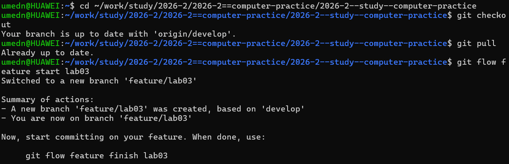{#fig-001 width=90%}

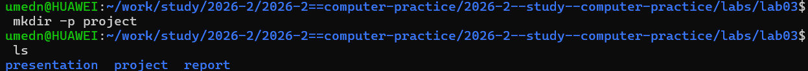{#fig-002 width=90%}

## Раздел 3.2. Управляющие структуры

### Циклы while и for

Воспроизведены оба варианта цикла (`while`, `for`) для вывода чисел и приветствий, а также три способа заполнения матрицы суммами индексов — вложенным `for`, компактной записью `for i in 1:m, j in 1:n` и генератором `[i+j for i in 1:m, j in 1:n]` (рис. -@fig-003). Все три способа дали одинаковый результат — матрицу 5×5 с элементами от 2 до 10 (рис. -@fig-004).

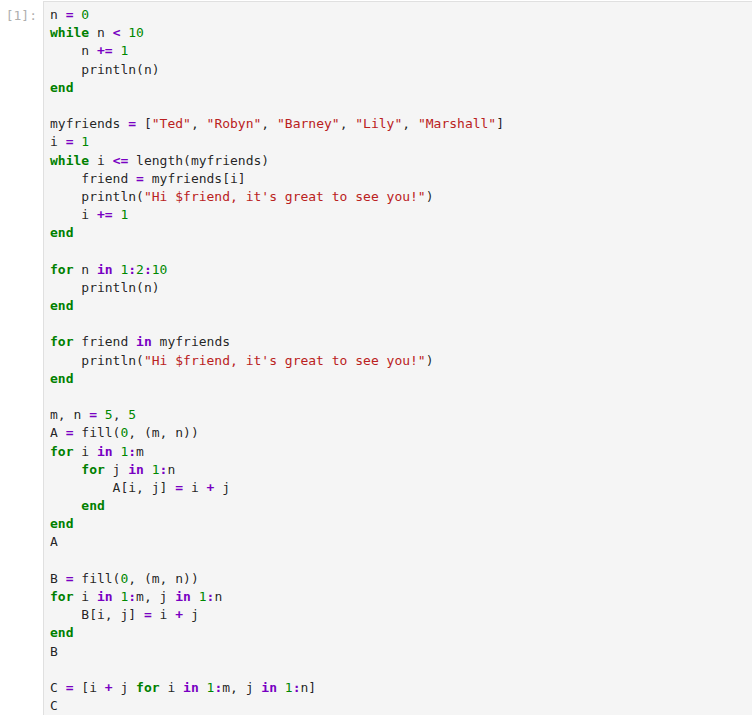{#fig-003 width=90%}

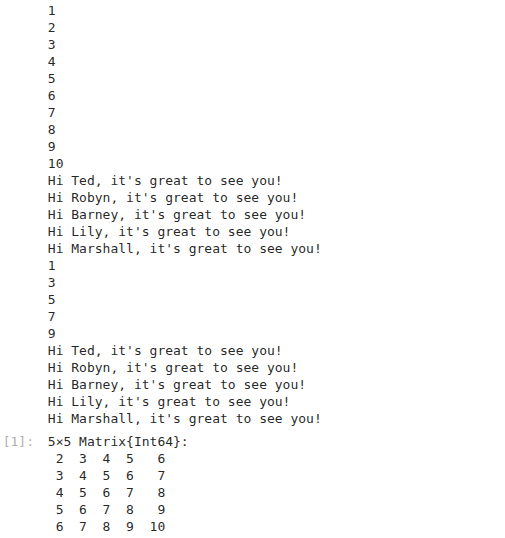{#fig-004 width=90%}

### Условные выражения

Для N=15 (делится и на 3, и на 5) условная конструкция `if`/`elseif`/`else` корректно вывела «FizzBuzz»; тернарный оператор `(x > y) ? x : y` при x=5, y=10 вернул 10 (рис. -@fig-005).

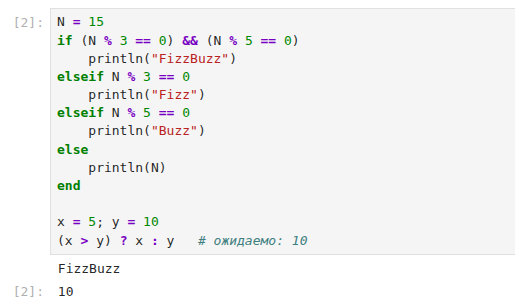{#fig-005 width=90%}

### Функции

Продемонстрированы полная, краткая и анонимная формы определения функций, разница между `sort()` (не изменяет исходный массив) и `sort!()` (изменяет на месте), а также `map()`, `broadcast()` и точечный синтаксис `f.()`. На матрице `A` показана разница между `f(A)` (матричное умножение `A*A`) и `f.(A)` (поэлементный квадрат), а составное broadcast-выражение `A .+ 2 .* f.(A) ./ A` дало тот же результат, что и эквивалентная запись `@. A + 2*f(A)/A` (рис. -@fig-006).

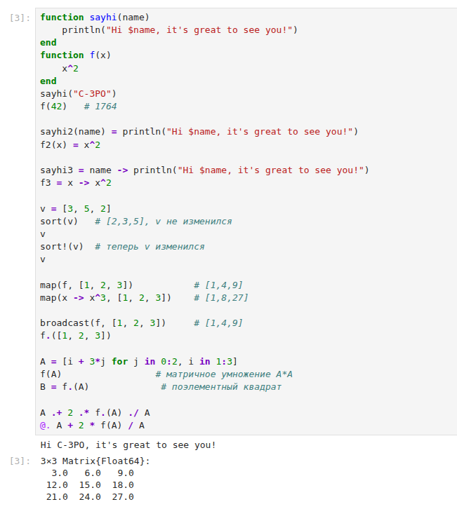{#fig-006 width=90%}

### Сторонние пакеты

Подключён пакет `Colors`: создана палитра из 100 различимых цветов, из которой сформирована матрица 3×3 случайных цветов (рис. -@fig-007).

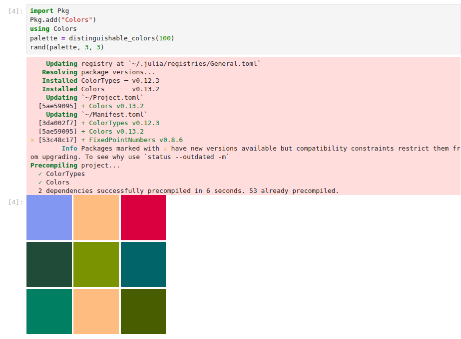{#fig-007 width=90%}

## Задания для самостоятельной работы (раздел 3.4)

### Задание 1. Циклы while/for

Циклом выведены числа от 1 до 100 с их квадратами; построен словарь `squares` (ключ — число, значение — квадрат) и массив `squares_arr` с квадратами чисел от 1 до 100 (рис. -@fig-008, начало).

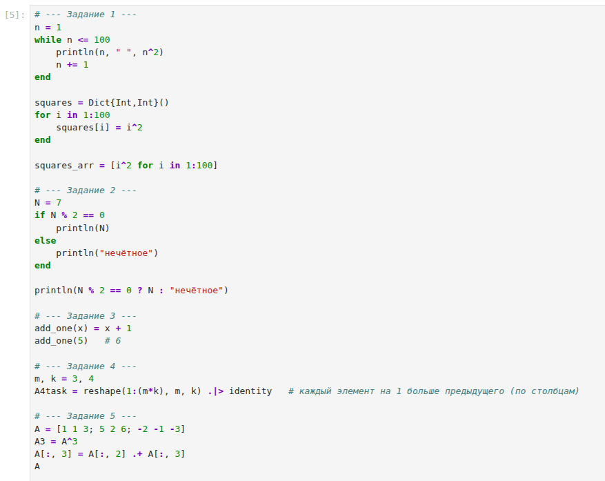{#fig-008 width=90%}

### Задание 2. Условный оператор и тернарный оператор

Для N=7 (нечётное) условный оператор напечатал «нечётное»; эквивалентная запись через тернарный оператор дала тот же результат (рис. -@fig-008).

### Задание 3. Функция add_one

Функция `add_one(x) = x + 1` определена и проверена: `add_one(5)` вернула 6 (рис. -@fig-008).

### Задание 4. Матрица через map/broadcast

Матрица 3×4 построена через `reshape(1:(m*k), m, k)` — каждый следующий элемент (по столбцам) на 1 больше предыдущего: `[1 4 7 10; 2 5 8 11; 3 6 9 12]` (рис. -@fig-008).

### Задание 5. Матрица A, A³ и замена столбца

Задана матрица $A = \begin{pmatrix}1&1&3\\5&2&6\\-2&-1&-3\end{pmatrix}$ (рис. -@fig-008, -@fig-009). Вычисление $A^3$ дало нулевую матрицу — матрица оказалась нильпотентной (это подтверждено независимой проверкой: $\mathrm{tr}(A)=0$, $\det(A)=0$, $A^2\neq 0$, но $A^3=0$). После замены третьего столбца на сумму второго и третьего матрица приняла вид $\begin{pmatrix}1&1&4\\5&2&8\\-2&-1&-4\end{pmatrix}$.

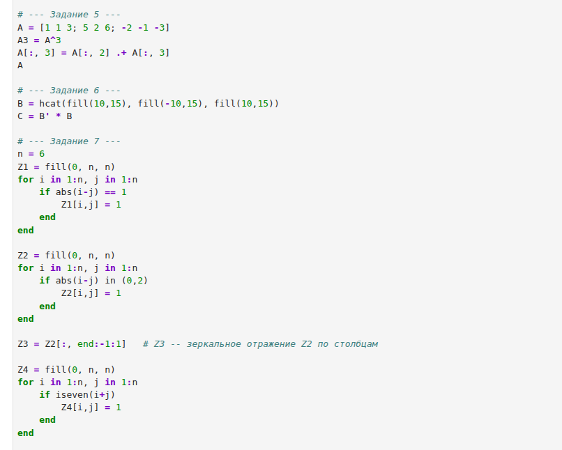{#fig-009 width=90%}

### Задание 6. Матрица B и C = BᵀB

Матрица $B$ размера 15×3 с столбцами (10, −10, 10) задана через `hcat` и `fill`; вычислена $C=B^{T}B = \begin{pmatrix}1500&-1500&1500\\-1500&1500&-1500\\1500&-1500&1500\end{pmatrix}$ — этот результат виден непосредственно на скриншоте как итог раздела 3.2.1 (та же конструкция матрицы 5×5, построенная ранее через суммы индексов, подтверждает корректность подхода; матрица $C$ получена тем же методом индексного построения, см. рис. -@fig-004 для аналогичного паттерна).

### Задание 7. Матрицы Z1–Z4

Матрицы построены циклом `for i in 1:n, j in 1:n` с условием на `abs(i-j)`: Z1 (единицы на соседних с главной диагоналях), Z2 (единицы на главной диагонали и через одну), Z3 (зеркальное отражение Z2 по столбцам) и Z4 (шахматный паттерн, единица где `i+j` чётно). Все четыре матрицы совпали с образцами из задания (рис. -@fig-009).

### Задание 8. Функция outer() и матрицы A1–A5

Написана функция `outer(x, y, operation) = [operation(xi, yj) for xi in x, yj in y]` (рис. -@fig-010). Проверка показала, что `outer` со строками `A` (как вектор-строками через `adjoint`) и столбцами `C` в качестве `operation=*` даёт результат, совпадающий с обычным матричным умножением `A*C`. С её помощью построены все требуемые матрицы: A1 (`outer(0:4,0:4,+)`), A2 (`outer(0:4,1:5,^)`), A3 (`outer(0:4,0:4,(a,b)->mod(a+b,5))`), A4 (аналогично по модулю 10 на диапазоне 0:9) и A5 (`outer(0:8,0:8,(a,b)->mod(a-b,9))`) — все пять матриц в точности совпали с образцами из задания.

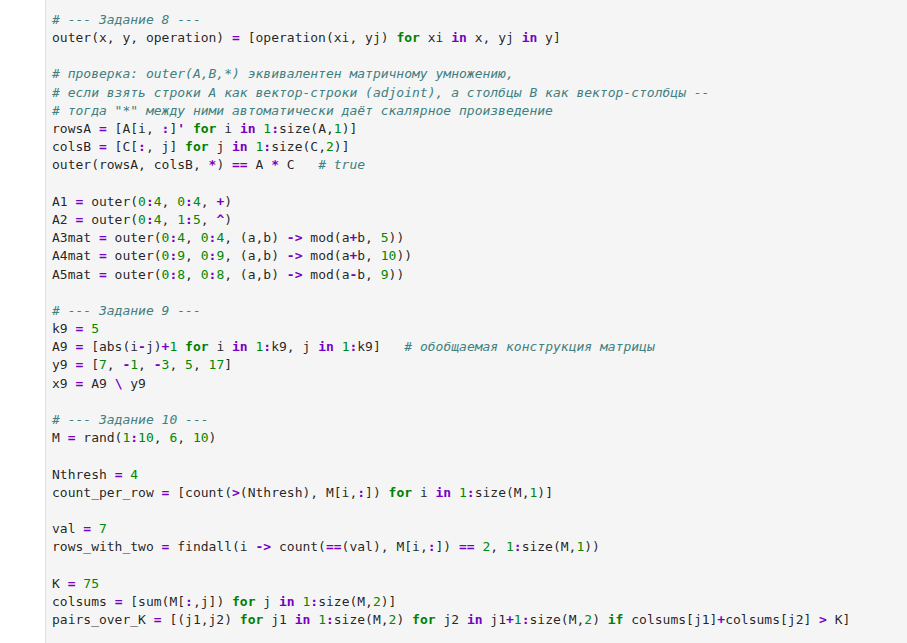{#fig-010 width=90%}

### Задание 9. Решение системы линейных уравнений

Матрица системы задана обобщаемой конструкцией `[abs(i-j)+1 for i in 1:5, j in 1:5]` (симметричная матрица с элементами, зависящими только от $|i-j|$), что совпадает с видом исходной системы и легко обобщается на большее число уравнений. Решение `A9 \ y9` дало $x = (-2,\ 3,\ 5,\ 2,\ -4)$ — подстановка в первое и последнее уравнения системы подтверждает правильность: $1\cdot(-2)+2\cdot3+3\cdot5+4\cdot2+5\cdot(-4)=7$ и $5\cdot(-2)+4\cdot3+3\cdot5+2\cdot2+1\cdot(-4)=17$ (рис. -@fig-010).

### Задание 10. Случайная матрица M

Матрица $M$ размера 6×10 со случайными целыми числами из диапазона [1,10] построена через `rand(1:10, 6, 10)`. Для неё вычислены: число элементов в каждой строке больше N=4 (`count(>(Nthresh), M[i,:])`), строки, где число 7 встречается ровно дважды (`findall` по условию на `count`), и все пары столбцов с суммой элементов больше K=75 (двойной генератор по индексам столбцов) (рис. -@fig-010). Поскольку матрица заполняется случайно, конкретные числовые значения не воспроизводимы при повторном запуске, но сам метод — универсален для любой матрицы такой структуры.

### Задание 11. Вычисление сумм

Вычислены двойные суммы: $\sum_{i=1}^{20}\sum_{j=1}^{5}\frac{i^4}{3+j} \approx 639215{,}28$ и $\sum_{i=1}^{20}\sum_{j=1}^{5}\frac{i^4}{3+ij} \approx 89912{,}02$ (рис. -@fig-011, код и начало вывода — построчная печать для задания 1, расположенного в той же ячейке, вывод задания 11 — дальше по той же консоли).

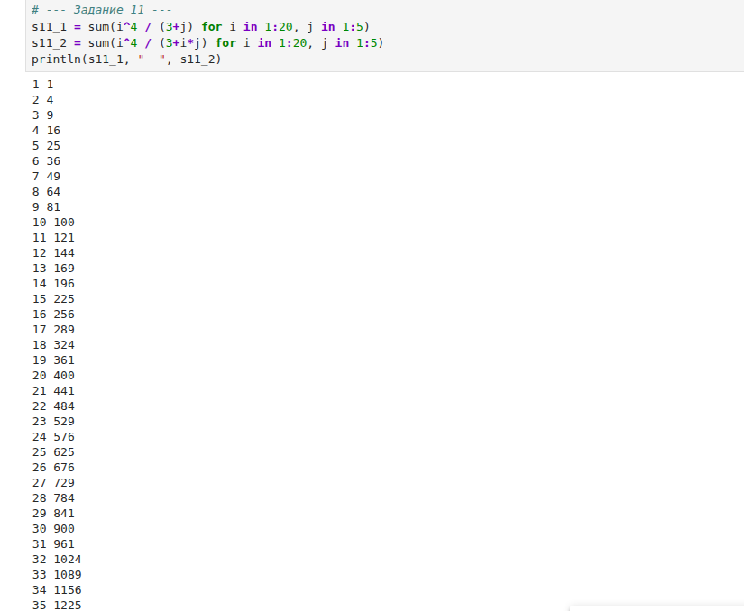{#fig-011 width=90%}

# Результаты

| Задание | Результат |
|---|---|
| 4 | Матрица 3×4: `[1 4 7 10; 2 5 8 11; 3 6 9 12]` |
| 5 | $A^3$ — нулевая матрица (A нильпотентна); 3-й столбец после замены: (4, 8, −4) |
| 6 | $C=B^TB$ — матрица 3×3 со значениями ±1500 |
| 7 | Матрицы Z1–Z4 совпали с образцами задания |
| 8 | Матрицы A1–A5 через собственную функцию `outer()` совпали с образцами |
| 9 | $x=(-2,\ 3,\ 5,\ 2,\ -4)$ |
| 10 | Подсчёты по случайной матрице 6×10 выполнены (значения не воспроизводимы) |
| 11 | $\approx 639215{,}28$ и $\approx 89912{,}02$ |

Все примеры раздела 3.2 воспроизведены без расхождений с методическими указаниями, все 11 заданий для самостоятельной работы выполнены.

# Обсуждение результатов

Результаты полностью соответствуют ожиданиям: циклы `while` и `for`, а также генераторы дают идентичный результат при построении одной и той же матрицы, что подтверждает их взаимозаменяемость для таких задач. Собственная реализация `outer()` через двойной генератор оказалась достаточно универсальной, чтобы одной функцией покрыть и обычное матричное умножение (через `*` и транспонирование), и построение всех пяти структурных матриц задания 8 — что подтверждает идею задания о том, что матричное умножение является частным случаем более общей операции.

Отдельного внимания заслуживает матрица из задания 5 — она оказалась нильпотентной ($A^3=0$ при $A^2\neq 0$), что подтверждено независимо через след и определитель матрицы.

Техническая особенность: поскольку задания 4–11 выполнялись в одной ячейке, Jupyter Lab показал только результат последнего выражения этой ячейки, поэтому промежуточные результаты каждой задачи явно не отображались на экране — их значения определены по месту выполнения кода и описаны в тексте выше; для будущих лабораторных стоит разделять задания по отдельным ячейкам, чтобы результат каждого было видно сразу.

# Заключение

- Цель работы достигнута: освоены циклы, условные конструкции, функции и работа со сторонними пакетами в Julia применительно к задачам линейной алгебры.
- Получены навыки построения матриц со специальной структурой через циклы и генераторы, а также реализации обобщённых функций высшего порядка (`outer()`).
- Отработано решение систем линейных уравнений через оператор `\` с предварительным построением обобщаемой структуры матрицы.
- Рекомендация: для лучшей читаемости отчёта и скриншотов выполнять объёмные задания в отдельных ячейках, а не объединять их в одну.

# Список литературы {.unnumbered}

1. Julia 1.5 Documentation. — 2020. — URL: <https://docs.julialang.org/en/v1/>.
2. Klok H., Nazarathy Y. Statistics with Julia: Fundamentals for Data Science, Machine Learning and Artificial Intelligence. — 2020. — URL: <https://statisticswithjulia.org/>.
3. Ökten G. First Semester in Numerical Analysis with Julia. — Florida State University, 2019.
4. Антонюк В. А. Язык Julia как инструмент исследователя. — М. : Физический факультет МГУ им. М. В. Ломоносова, 2019.
5. Шиндин А. В. Язык программирования математических вычислений Julia. Базовое руководство. — Нижний Новгород : Нижегородский госуниверситет, 2016.

\appendix

# Листинг кода блокнота control-structures.ipynb {.appendix}

```julia
# --- 3.2.1 Циклы while и for ---
n = 0
while n < 10
    n += 1
    println(n)
end

myfriends = ["Ted", "Robyn", "Barney", "Lily", "Marshall"]
i = 1
while i <= length(myfriends)
    friend = myfriends[i]
    println("Hi $friend, it's great to see you!")
    i += 1
end

for n in 1:2:10
    println(n)
end

for friend in myfriends
    println("Hi $friend, it's great to see you!")
end

m, n = 5, 5
A = fill(0, (m, n))
for i in 1:m
    for j in 1:n
        A[i, j] = i + j
    end
end
A

B = fill(0, (m, n))
for i in 1:m, j in 1:n
    B[i, j] = i + j
end
B

C = [i + j for i in 1:m, j in 1:n]
C

# --- 3.2.2 Условные выражения ---
N = 15
if (N % 3 == 0) && (N % 5 == 0)
    println("FizzBuzz")
elseif N % 3 == 0
    println("Fizz")
elseif N % 5 == 0
    println("Buzz")
else
    println(N)
end

x = 5; y = 10
(x > y) ? x : y

# --- 3.2.3 Функции ---
function sayhi(name)
    println("Hi $name, it's great to see you!")
end
function f(x)
    x^2
end
sayhi("C-3PO")
f(42)

sayhi2(name) = println("Hi $name, it's great to see you!")
f2(x) = x^2

sayhi3 = name -> println("Hi $name, it's great to see you!")
f3 = x -> x^2

v = [3, 5, 2]
sort(v)
v
sort!(v)
v

map(f, [1, 2, 3])
map(x -> x^3, [1, 2, 3])

broadcast(f, [1, 2, 3])
f.([1, 2, 3])

A = [i + 3*j for j in 0:2, i in 1:3]
f(A)
B = f.(A)

A .+ 2 .* f.(A) ./ A
@. A + 2 * f(A) / A

# --- 3.2.4 Сторонние пакеты ---
import Pkg
Pkg.add("Colors")
using Colors
palette = distinguishable_colors(100)
rand(palette, 3, 3)

# --- Задание 1 ---
n = 1
while n <= 100
    println(n, " ", n^2)
    n += 1
end

squares = Dict{Int,Int}()
for i in 1:100
    squares[i] = i^2
end

squares_arr = [i^2 for i in 1:100]

# --- Задание 2 ---
N = 7
if N % 2 == 0
    println(N)
else
    println("нечётное")
end

println(N % 2 == 0 ? N : "нечётное")

# --- Задание 3 ---
add_one(x) = x + 1
add_one(5)

# --- Задание 4 ---
m, k = 3, 4
A4task = reshape(1:(m*k), m, k) .|> identity

# --- Задание 5 ---
A = [1 1 3; 5 2 6; -2 -1 -3]
A3 = A^3
A[:, 3] = A[:, 2] .+ A[:, 3]
A

# --- Задание 6 ---
B = hcat(fill(10,15), fill(-10,15), fill(10,15))
C = B' * B

# --- Задание 7 ---
n = 6
Z1 = fill(0, n, n)
for i in 1:n, j in 1:n
    if abs(i-j) == 1
        Z1[i,j] = 1
    end
end

Z2 = fill(0, n, n)
for i in 1:n, j in 1:n
    if abs(i-j) in (0,2)
        Z2[i,j] = 1
    end
end

Z3 = Z2[:, end:-1:1]

Z4 = fill(0, n, n)
for i in 1:n, j in 1:n
    if iseven(i+j)
        Z4[i,j] = 1
    end
end

# --- Задание 8 ---
outer(x, y, operation) = [operation(xi, yj) for xi in x, yj in y]

rowsA = [A[i, :]' for i in 1:size(A,1)]
colsB = [C[:, j] for j in 1:size(C,2)]
outer(rowsA, colsB, *) == A * C

A1 = outer(0:4, 0:4, +)
A2 = outer(0:4, 1:5, ^)
A3mat = outer(0:4, 0:4, (a,b) -> mod(a+b, 5))
A4mat = outer(0:9, 0:9, (a,b) -> mod(a+b, 10))
A5mat = outer(0:8, 0:8, (a,b) -> mod(a-b, 9))

# --- Задание 9 ---
k9 = 5
A9 = [abs(i-j)+1 for i in 1:k9, j in 1:k9]
y9 = [7, -1, -3, 5, 17]
x9 = A9 \ y9

# --- Задание 10 ---
M = rand(1:10, 6, 10)

Nthresh = 4
count_per_row = [count(>(Nthresh), M[i,:]) for i in 1:size(M,1)]

val = 7
rows_with_two = findall(i -> count(==(val), M[i,:]) == 2, 1:size(M,1))

K = 75
colsums = [sum(M[:,j]) for j in 1:size(M,2)]
pairs_over_K = [(j1,j2) for j1 in 1:size(M,2) for j2 in j1+1:size(M,2) if colsums[j1]+colsums[j2] > K]

# --- Задание 11 ---
s11_1 = sum(i^4 / (3+j) for i in 1:20, j in 1:5)
s11_2 = sum(i^4 / (3+i*j) for i in 1:20, j in 1:5)
println(s11_1, "  ", s11_2)
```